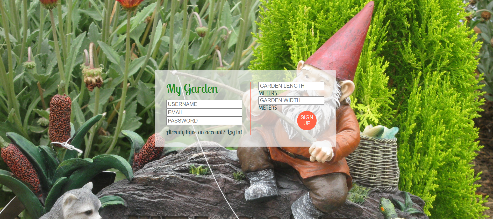

# My Garden APP

### Concordia full stack development bootcamp final project with React

Responsive app that creates an account with MongoDB. Each account will contain a garden made of grid of divs that will be saved into the database as an array. The size of the garden is customized by the users and the plants data is fetched from harvesthelper.herokuapp.com.

The app lets you drag plants into your garden. Each plant will occupy the space required based on the plant's needs and overlapping plants is not possible.
You can find icons in different places that on click will provide appropriate informations ( sun needs, harvest times..).

In order to avoid too many fetches to the server, I used Redux. The most challenging part of this app would have to be managing the grid of data.
